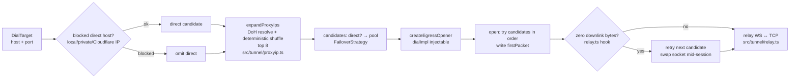

# Q Proxy — Developer Guide

> User-facing deploy and panel docs: [USER_GUIDE.md](USER_GUIDE.md). Frozen contracts: [ARCHITECTURE.md](ARCHITECTURE.md). Agent-facing subsystem map: [../CONTEXT.md](../CONTEXT.md).

## 1. Stack & Principles

| Concern | Choice | Evidence |
|---------|--------|----------|
| Runtime | Cloudflare Workers | `wrangler.toml` `compatibility_date = "2026-08-01"`; `cloudflare:sockets` TCP egress |
| Language | TypeScript strict (`ES2023`) | `tsconfig.json` (strict, `workers-types`) |
| Build | esbuild single-file `dist/q-proxy.js` | `scripts/build-single-file.mjs` — `format: esm`, `platform: browser`, loader `.html → text`, `define __APP_VERSION__` |
| Deps | Zero runtime deps | `package.json` devDeps only; build asserts no bare imports except `cloudflare:*` |
| Storage | KV (`QPROXY_KV`) for settings/WARP/throttle state + D1 (`QPROXY_DB`, `migrations/`) for write-hot state | `wrangler.toml`, `src/env.d.ts` (generated by `wrangler types`), `src/settings/store.ts:bootstrapD1` |
| Tests | vitest 2 projects | `vitest.config.ts` — `unit` (node) + `workers` (`@cloudflare/vitest-pool-workers`) |

Ground rules (`ARCHITECTURE.md §0`): compat `2026-08-01` forces `binaryType = "arraybuffer"` on every server socket; parsers never throw (`Result` convention); named exports only; no comments in impl — rationale lives here.

## 2. Getting Started

```bash
npm install          # devDeps: typescript, esbuild, vitest, wrangler, @cloudflare/workers-types
npm run typecheck    # tsc --noEmit — must pass per DoD
npm test             # vitest run — both projects, see §3
npm run dev          # wrangler dev → http://127.0.0.1:8787 (miniflare, KV in-memory)
npm run build        # esbuild → dist/q-proxy.js (dashboard-pasteable)
npm run deploy       # build + wrangler deploy
```

Gotcha: `wrangler dev` serves `dist/q-proxy.js` (per `wrangler.toml main=`). Source edits are invisible until you rebuild.

## 3. Testing

### 3.1 Runner

`vitest.config.ts` defines two projects:

```ts
projects: [
  { name: 'unit',    environment: 'node', include: ['test/**/*.spec.ts'], exclude: ['test/workers/**', 'test/d1/**'] },
  { name: 'workers', include: ['test/workers/**/*.spec.ts', 'test/d1/**/*.spec.ts'],
    miniflare: { compatibilityDate: '2026-08-01', kvNamespaces: ['QPROXY_KV'], d1Databases: ['QPROXY_DB'] } }
]
```

D1-backed specs live in `test/d1/` (counters, audit log, schema setup) and run in the `workers` project against a provisioned `QPROXY_DB`. Helpers in `test/helpers/seed.ts`: `seed(kv, securePath, overrides)`, `resetThrottle()`, `applyD1Schema(db)`, `resetD1(db)` (empties counters/audit/meta).

| Command | What runs |
|---------|-----------|
| `npm test` | Both projects |
| `npx vitest run --project=unit` | Pure logic — no workerd needed (`src/core/**` may not import `cloudflare:*`) |
| `npx vitest run --project=workers` | Real `fetch` through `src/worker.ts` with `fetchMock` for DoH |

Layout rule: specs mirror `src/` — `src/protocols/vless.ts` ⇔ `test/protocols/vless.spec.ts`, `src/handlers/api/settings.ts` ⇔ `test/workers/handlers/api/settings.spec.ts`.

### 3.2 Coverage Map

| Group | Project | Example |
|-------|---------|---------|
| Crypto (X25519 for WARP, HMAC, hashes) | unit | RFC vectors in `test/crypto/*` |
| VLESS parser (chunk-split `push()`, 16 KiB/10 s caps, reject paths) | unit | Synthetic frames per `docs/research/04-protocol-formats.md` |
| Share URIs + sing-box emitter (golden snapshots) | unit | `test/nodes/emitters/*.spec.ts` |
| WARP parsers/formatters, x25519 keypairs | unit | `test/warp/*` |
| Settings migrate/validate/seed, UA, proxyIP pool, failover planner | unit | Mocked `fetch` for DoH/TXT |
| Router/auth/KV/sub/tunnel smoke (injectable `dialImpl`) | workers | `test/workers/core/router.spec.ts`, `test/workers/handlers/*`; bootstrap gate + setup-window specs in `test/workers/auth-flow.spec.ts` |
| D1 stores (counters, audit, schema setup, provisioned `QPROXY_DB`) | workers | `test/d1/*`, `test/helpers/seed.ts` fixtures |

### 3.3 Testing Protocol Changes

Protocol work is highest-risk — validate against **Xray-core vectors**, not just unit synthetics:

1. Add/update the unit spec with frame bytes from the Xray `proxy/vless` test fixtures.
2. Assert `reject` → WS `1008` (never leaks reason), `need-more` on split chunks, `ready.parsed` + correct `rest` and `responseHeader()`.
3. Add a `workers` smoke that upgrades via `WebSocketPair` with injectable `dialImpl` (raw sockets unavailable in the pool).
4. Run `npm run typecheck && npm test`; golden emitter snapshots must not drift without review.

## 4. Architecture

### 4.1 Request Lifecycle

```mermaid
flowchart TD
    A[Client Request] --> B{GET /robots.txt?}
    B -- yes --> R1[handlers/robots.ts<br/>Disallow: /]
    B -- no --> C{identifyTunnel?<br/>src/core/routes.ts}
    C -- "/{vlessPath}/ + suffix [A-Za-z0-9]{8,32}" --> D{WS Upgrade?}
    D -- no --> CAM[handlers/camouflage.ts<br/>static page or refusal]
    D -- yes --> K{killSwitch?}
    K -- on --> S503[503 Service Unavailable]
    K -- off --> T[handlers/tunnel.ts<br/>early-data b64url decode ≤ maxBytes]
    T --> P[protocols/createVlessInbound<br/>push → ready / reject→1008]
    P --> E[egress makeFailoverStrategy]
    C -- no --> E2{resolveSecureRoute<br/>src/core/routes.ts}
    E2 -- "/{sp}/sub" --> SUB[handlers/subscribe.ts]
    E2 -- "/{sp}/sub/wg/{token}/{format}" --> WSUB[handlers/warp-sub.ts]
    E2 -- "/{sp}/doh" --> DOH[handlers/doh.ts]
    E2 -- "/{sp}/api/* or telegram/*" --> API[dispatchApi<br/>auth guard + CSRF]
    E2 -- "/{sp}/panel|/login|root" --> PAGE[panel-page.ts<br/>ASSETS]
    E2 -- null --> CAM
    SUB --> GEN[nodes/generate.ts → ProxyNode[]]
    GEN --> EMI[emitters/registry.ts<br/>sing-box; base64 renders in subscription/render.ts]
```

Route precedence is top-down, first match wins — the route table is defined in `ARCHITECTURE.md §3`, implemented by `routeRequest` in `src/core/router.ts`, with tunnel dispatch via `identifyTunnel` and secure dispatch via `resolveSecureRoute`. Kill switch is checked before any WebSocket upgrade. Retired URL shapes (former tunnel paths, old token links, deleted admin endpoints) resolve to no route and serve camouflage, indistinguishable from unknown paths.

Auth: `q_session` HMAC cookie (`src/auth/session.ts`) + `X-Q-Panel: 1` CSRF header on mutating APIs (`src/auth/guard.ts`). Password-only login; no second factor. Non-panel failures return camouflage, never 404.

### 4.2 Egress Failover Strategy



Implementation: `makeFailoverStrategy(settings, target)` builds candidates; `createEgressOpener(strategy, dialImpl?, opts?)` sequential-walks with a default dial that writes `firstPacket` eagerly. Walks are capped by a 15 s total dial budget (`TOTAL_DIAL_BUDGET_MS`, overridable via `EgressOpenerOptions.totalBudgetMs`) so hanging candidates can't stack N× per-dial timeouts. `openEgressWithSpeculativeDirect` starts the synchronously-known direct dial before proxyIP tail expansion finishes and reuses it in the opener; late sockets that lose the race are closed. Zero-byte retry is triggered by `relay.ts`, not `egress.ts` itself. Egress is direct + proxyIP pool only.

### 4.3 Emitter Pipeline

```mermaid
flowchart TD
    REQ[GET /{sp}/sub<br/>pickSubFormat: target param > classifyUA > base64<br/>browser → info page] --> GEN[generateNodes<br/>VLESS × endpoints (presets+custom+hostname) × ports × variants<br/>invariants: security↔port, fragment→TLS only, uniform variants]

    GEN --> EMI[registry: singbox-json<br/>base64 renders in subscription/render.ts]
    EMI --> H[subscriptionHeaders<br/>Profile-Title · Subscription-Userinfo · Content-Disposition]
    H --> RESP[Response<br/>edge Cache API 60s keyed format+mode+settings-version]
```

Routing-rule settings inject sing-box rule sections at emit time (bypass-LAN, block QUIC/ads/malware, custom suffix lists). URI grammars live in `src/nodes/share-uri.ts`; remark naming in `src/nodes/naming.ts`. Flow stamping: `generateNodes` copies `settings.vlessFlow` onto TLS VLESS nodes only (`flow: null` on plain nodes, legacy output byte-identical when the setting is empty); `buildVlessShareUri` appends `flow=` after the transport params; the sing-box emitter adds `flow` accordingly. sing-box DNS is typed servers by default: `proxy-dns` `{type, server, detour: "PROXY"}` with `domain_resolver: "local-dns"` for domain-hosted upstreams, non-default `server_port`/`path` preserved, `local-dns` `{type: "local"}` — no `address` keys remain (see `dnsServerEntry` in `src/nodes/emitters/singbox-json.ts`).

Node-generation sources (`resolveEndpointLines` + `collectAddresses` in `src/nodes/generate.ts`): ticked `cdnPresets` ids (8 shipped entries in `src/nodes/cdn-presets.ts`, all opt-in; unknown ids ignored, never errors) + verbatim `customEndpoints` lines + worker-hostname fallback when both are empty. Bare hosts resolve via `defaultPort` (TLS-only values allowed); explicit ports must pass CF-family validation at save (`endpointLinesField(..., enforceCfPorts: true)` rejects the whole save naming bad lines) — a residual out-of-family port reaching generation maps to no security (`classifyPort` → null) and emits nothing for that line. Dedupe is by lowercased `host:port` across presets+custom. Fragment variants apply uniformly: every TLS endpoint gains a fragment variant when fragment mode is on, with no per-variant endpoint splitting. The old `addresses[]` / `AddressSetting` list and the `?country=` filter are removed (pre-cut data dropped on upgrade, not migrated).

WARP endpoint selection (`expandAccount` in `src/warp/expand.ts`): ONE global source — `warpPresets[]` (default `["default"]`) + verbatim `warpCustomEndpoints[]` lines — governs every account and all four output families (`wireguard-conf` ZIP, `singbox` JSON, `v2rayn` base64 links, `throne` always-Amnezia links). Amnezia is one global switch (`WarpGlobalSettings.amneziaEnabled`, default `false`, same KV record): on, the WireGuard and sing-box outputs carry the Amnezia values; Throne always does; v2rayn never does. Flipping the switch (or rotating credentials) purges served copies via `warp/cache.ts`, so the next fetch per family is fresh. Per-account `endpoint_list` and `amnezia_overrides` are retired — stored values are ignored at render and on write, not migrated. An empty global selection resolves to the `default` preset (never an empty config); unknown preset ids are ignored. Deleted format names (`wireguard-conf-amnezia`, `throne-amnezia`, `wireguard-uri`, `singbox-*` twins, `xray`, `clash*`, `surge`, `surfboard`, `loon`, `egern`) fall through to `handleCamouflage` identical to unknown URLs. WARP custom lines allow any port 1–65535 (`enforceCfPorts: false`; WireGuard ports like 2408/500/1701 are not CF ports) under the same per-line discipline as VLESS (named rejects, verbatim keeps, ≤64 lines); custom endpoints are render-only, never dialed or probed server-side.

The two subscription targets are exactly `base64` and `singbox` (`SUB_FORMATS` in `src/subscription/negotiate.ts`). Any other `?target=` value throws `BadRequestError("invalid target")` (400). Only the worker hostname plus enabled presets plus valid custom lines are ever emitted — nothing is fetched from elsewhere or merged.

## 5. KV Schema

Namespace binding `QPROXY_KV`.

| Key | Shape | Writer | TTL / Cache |
|-----|-------|--------|-------------|
| `qproxy:settings` | `{version, updatedAt, data:Settings}` | `src/settings/store.ts:saveSettings` | Isolate cache 60 s + KV `cacheTtl:60`; save invalidates |
| `qproxy:meta` | `{createdAt, installedVersion}` | `store.ts:ensureInitialized` (once) | — |
| `qproxy:counters` | `{day, requestsToday, requestsTotal, updatedAt}` | `src/core/counters.ts:recordConnection` | Buffered per-isolate; flush >60 s or every 32 conns |
| `qproxy:ratelimit:{key}:{window}` | tunnel/login throttle bucket `{tokens, updatedAt}` (1-min window stamp) | `src/tunnel/ratelimit.ts:tryConsume` + login guard | 120 s TTL, fail-open on KV error |
| `qproxy:warp:account:{id}` / `qproxy:warp:token:{token}` / `qproxy:warp:presets` / `qproxy:warp:global` | WARP device + preset state | `src/warp/store.ts` | Two-key write with rollback |

Sessions are stateless HMAC cookies — no session records in KV. Sensitive paths `passwordHash`, `passwordSalt`, `sessionSecret` (plus write-only `telegram.botToken`) never leave authenticated views.

### D1 database (binding `QPROXY_DB`)

Write-hot state lives in D1, core schema created by `src/settings/store.ts:ensureD1Schema` (mirrored in `migrations/`):

| Table | Rows | Writer |
|-------|------|--------|
| `counters` | Single row (`id = 1`): day, requests_today/total, bytes_up/down | `src/core/counters.ts:flushD1` (SELECT + UPSERT batch; KV fallback on error) |
| `audit_log` | `{ts, ip, action, detail}` rows | `src/core/log.ts:audit` (via `waitUntil`; context bound through `bindCounterContext`) |
| `meta` | Schema bookkeeping | `bootstrapD1` |

Rules: all increments are single-statement `ON CONFLICT … DO UPDATE` UPSERTs (no read-modify-write, race-free across isolates). On first boot over a pre-cut store, `maybePurgePreCut` deletes retired KV keys and drops retired D1 tables, writes one log note of what was removed, and stamps the blob to version 3; re-running on a version-3 store is a no-op. Counters and the audit log survive the purge untouched. `StoreEnv` (`{QPROXY_KV, QPROXY_DB?}`) is the store-layer env type so unit-adjacent callers stay D1-optional; the production `Env` requires `QPROXY_DB`.

### Migrations

`src/settings/migrate.ts:migrateSettings(raw)` — pure, no IO:

1. Non-object or missing `version` → `structuredClone(DEFAULT_SETTINGS)` + seed identity.
2. `version === SETTINGS_VERSION` → deep-merge stored data over a clone of defaults (fills new keys).
3. `version < SETTINGS_VERSION` → apply `MIGRATIONS[v]` sequentially then rule 2 (the v2 step drops retired keys and normalizes camouflage mode to `off`/`static`).
4. `version > SETTINGS_VERSION` (downgrade) → rule 2 + warning log.

`SETTINGS_VERSION = 3` in `src/types/settings.ts` — bump with a migration entry per settings shape change. Import is stricter than boot: `POST api/settings/import` rejects a backup whose version is below 3 whole, with a clear pre-cut message, applying nothing.

## 6. Subscription Outputs Are Frozen

The VLESS subscription surface is exactly two targets — `base64` and `singbox` — plus the browser info page. There is no pipeline for adding further VLESS targets in this codebase state:

1. **Types:** `SubFormat` in `src/core/ua.ts` is `"base64" | "singbox"`; `classifyUA` sniffs sing-box tokens, base64-client tokens, browsers, and defaults to base64.
2. **Emitters:** `src/nodes/emitters/registry.ts` (`EMITTERS` covers sing-box only; base64 renders in `src/subscription/render.ts`).
3. **Negotiation:** `SUB_FORMATS` in `src/subscription/negotiate.ts` is the single source of the target list; unknown `?target=` values throw `invalid target`.
4. **Serving one-liners:** content types in `SUB_CONTENT_TYPES` (`src/subscription/render.ts`), extensions in `EXTENSIONS` (`src/subscription/headers.ts`), labels in `src/handlers/subscribe.ts`, `?target=` entries in `buildSubUrls` (`src/handlers/api/status.ts`).
5. **Tests:** golden snapshots in `test/nodes/emitters/`, UA cases in `test/core/ua.spec.ts`, content-type/extension cases in `test/subscription/`.

Keep emitters pure — no KV, no `fetch`, no `cloudflare:*` imports, so they stay in the `unit` project. Wire-format changes alter emitter output on purpose: goldens break; get owner sign-off first.

Adding a **WARP** format follows the same shape via `src/warp/formats/`: implement `(ctx: WarpEmitContext) => string | Uint8Array` and register it in `WARP_FORMATS` + `WARP_EMITTERS` + content-type/extension maps in `src/warp/formats/registry.ts`.

## 7. Project Conventions

- **Error handling:** throw `AppError` subclasses (`src/core/errors.ts`) — `worker.ts` single boundary renders the JSON envelope for `/api/*` else sanitized HTML. Tunnel plane: `reject` → WS close `1008`; infra failure → `1011`.
- **Early data:** `src/tunnel/websocket.ts` extracts the `Sec-WebSocket-Protocol` b64url payload (≤ `earlyDataMaxBytes`); handshake buffer capped 16 KiB / 10 s.
- **Logging:** `src/core/log.ts` debug-gated with request id; never logs deny-list material (passwords, hashes, UUIDs, session secrets, securePath free-text).
- **Camouflage:** `src/handlers/camouflage.ts` — static page when `camouflage.mode === "static"`, bare refusal when `off`; `/robots.txt` always `Disallow: /`. Retired URL shapes fall through here like any unknown route.
- **Relay admission gate:** the tunnel consults `tryConsume(env, key)` in `src/tunnel/ratelimit.ts` (token bucket 30/min + burst 10, 120 s KV TTL, fail-open) before accepting the socket; a denied admission throws the rate-limited error. The relay never imports KV itself.

## 8. References

- Architecture: [ARCHITECTURE.md](ARCHITECTURE.md) — frozen types, route table (§3), data flows (§4), KV (§5), build (§8)
- Agent map: [../CONTEXT.md](../CONTEXT.md) — subsystem index + conventions cheat-sheet
- Research: `docs/research/01-bpb-panel.md` … `04-protocol-formats.md`
- Transport decisions: `docs/decisions/ADR-006-grpc-feasibility.md` · `ADR-007-xhttp-feasibility.md` · `ADR-008-reality-remote.md` · `ADR-009-transport-roadmap.md`
- Deploy auth: Cloudflare Global API Key env vars (see [../README.md](../README.md))

## 9. Protocol Internals (src/protocols/)

| File | Export | Semantics |
|------|--------|-----------|
| common.ts | `ProtocolInbound<R>`, `PushOutcome`, `parseAddress` | push(data) → need-more / ready{parsed, rest} / reject; responseHeader() once |
| vless.ts | `createVlessInbound(uuid)` | Verifies 16-byte UUID; cmd 1 tcp, cmd 2 udp port 53 only → DnsPacketRelay; rejects MUX cmd 3; header `[ver, 0x00]`; vision: substring-matches `xtls-rprx-vision` in the handshake addons on TCP only (UDP keeps the UDP codec) → `bodyCodec()` serves a length-prefixed (`u16be len + payload`) codec — handshake coalesces complete initial frames and seeds the partial tail, 64 KiB buffer cap (overflow resets + null), split frames buffer across `decodeUp` calls, downlink encoder has null header and maps empty/oversize encodes to empty, never throws |

Handshake bounded: 16 KiB accumulated + 10 s timeout → WS close 1008. Reasons logged server-side only.

## 10. Settings Store (src/settings/)

- store.ts: `loadSettings(env)` with 60 s isolate cache; `saveSettings` validates then deep-merges; `ensureInitialized` seeds securePath + UUID + sessionSecret once. Stored blob carries a monotonic `rev` (bumped via a fresh KV read on every save, returned to callers); all four write paths (save/reset/import/killswitch) merge from `loadSettingsFresh`, not the isolate cache. First boot over a pre-cut blob purges retired data with one log note and stamps version 3.
- seed.ts: `randomHex(12)` securePath, `randomUUID()` for an empty VLESS UUID, 24-char passwords.
- validate.ts: full-schema validation → `{ok:false, fields}` map for 422 responses. ECH server-name resolution is `resolveEchServerName(settings, sni)`: disabled ⇒ null, manual `echServerName` wins, else `echAuto` derives the domain-shaped SNI (warning string when unresolvable).
- `allowedIps` is a `{kind:"custom"}` descriptor-validated list (trim/dedupe/drop-empty, 64-entry cap; exact IP or v4/v6 CIDR only — hostnames and `ip:port` rejected). Enforcement is `isIpAllowlisted` + a `requireAuth` check after session verification (401 before 403).
- `cdnPresets` / `warpPresets` are id-list fields (trim/dedupe, 64-entry cap; unknown ids ignored at generation, never errors). `customEndpoints` / `warpCustomEndpoints` go through `endpointLinesField` (per-line `parseHostPort`; VLESS enforces CF families, WARP allows any port 1–65535; the whole save is rejected naming `line N "…"` truncated to 64 chars; stored lines are verbatim trimmed keeps; blanks ignored; 64-line cap). `defaultPort` accepts TLS-family ports only.
- `vlessFlow` is an `{kind:"enum", allowed:["", "xtls-rprx-vision"]}` descriptor (`VLESS_FLOWS` in `src/settings/fields.ts`, default `""`), bound in the panel registry. Unknown flow strings fail validation with English field errors.
- `passwordIsBootstrap` (`{kind:"bool"}`, default `false`) and `seededAt` (`{kind:"int"}`, default `0`) back the onboarding bootstrap flow (no `SETTINGS_VERSION` bump — deep-merge defaults fill absent keys). `fillIdentity` stamps `seededAt = Date.now()` only when it was `0`; `validateBootstrapConsistency` rejects `passwordIsBootstrap: true` without an existing `passwordHash`. While the flag is on, `dispatchApi`'s `bootstrapGated` wrapper answers `403 PASSWORD_CHANGE_REQUIRED` on every authed route except the exemption rows (`auth-logout`/`auth-password`/`bootstrap` = `allow`, `settings-get` = `read` ⇒ GET-only); `handleSetup` refuses first-password setup once `seededAt` is older than 24 h (409 `SETUP_WINDOW_EXPIRED`), and `handlePasswordChange` saves `passwordIsBootstrap: false` to lift the gate.
- migrate.ts: pure stepwise migrations — see §5.

## 11. Observability

- log.ts: debug-gated structured logging with request id; redaction deny-list asserted in tests.
- counters.ts: `readUsage`/`recordConnection` with isolate-buffered flush — D1-first (`flushD1` batch), KV fallback on error; the `Subscription-Userinfo` estimate derives from it (`download ≈ requestsTotal × 1 MiB`).
- audit trail: `audit(action, detail, env?)` in `src/core/log.ts` emits a JSON `info` line (`scope:"audit"`) via the `log.info` seam and persists to the D1 `audit_log` table when `env.QPROXY_DB` is present (fire-and-forget through `waitUntil`; wire the context with `bindCounterContext`). Allowlist design — only caller-supplied fields are serialized (`settings.save|reset|import` → `{ip, keys}`, `killswitch` → `{ip, enabled}`, `warp.account.*`/`warp.preset.*` → `{ip, id}`, `warp.amnezia.update` → `{ip}`); never pass values or secrets, only key names/ids/booleans.

## 12. Local Development Tips

- Miniflare auto-creates in-memory KV; a dummy id in `wrangler.toml` is fine locally.
- Test early data locally: client must send `Sec-WebSocket-Protocol: base64url(firstFrame)` and `ed=2048` in the URI.
- Fragment testing: set `fragment.mode=low`, request `?target=singbox&mode=fragment`; fragment params appear only there.
- If `wrangler dev` wedges (workerd accepts connections but never responds), kill the stray workerd process and relaunch on another port (`npx wrangler dev --port 8788`).

## 13. Build Reproducibility

`scripts/build-single-file.mjs` bundles `src/worker.ts` with esbuild (bundle, esm, browser, es2023, minify, `.html`→text, `__APP_VERSION__` define). Post-build asserts no bare imports except `cloudflare:*` and writes `dist/q-proxy.js` (~400 KB). Same artifact for dashboard paste and wrangler deploy.

Panel assembly runs first in the same script: `src/ui/panel/` sources (`shell.html` + 3 markers `<!--panel:head-js-->/<!--panel:css-->/<!--panel:js-->`, `head.js`, `app.css`, 19 JS parts concatenated in fixed order dict→format-labels→lib→a11y→qr→states→home→warp→subs→share→chrome→settings→sections-registry→fields-render→cards→fields-validate→section-io→sections→actions) are string-spliced into `src/ui/panel.html`, which is git-kept generated output — edit the sources, never the output (see `src/ui/panel/README.md`). The build fails on missing/duplicated/leftover markers and `node --check`s the script blocks; `panel.html` is rewritten only when bytes change. `test/ui/assets.spec.ts` pins this: no markers in the shipped panel, deterministic assembly, committed output in sync with sources. `login.html`/`camo.html` are untouched by this flow.

## 14. FAQ for Contributors

- Why no comments in impl? Rationale lives in `ARCHITECTURE.md`; impl stays auditable without annotation drift.
- Why D1 alongside KV? Write-hot state (counters, audit rows) raced under KV read-modify-write across isolates; single-statement D1 UPSERTs are race-free. The settings blob stays on KV (single-key read + 60 s isolate cache fits it), as do the WARP store and throttle keys.
- Adding a route? Requires an architecture revision: update `ARCHITECTURE.md §3` + `src/core/router.ts` + `test/workers/router.spec.ts`.

## 15. File Ownership (ARCHITECTURE.md §9)

| Wave | Owner | Files |
|------|-------|-------|
| A | Scaffold | package.json, tsconfig, vitest.config.ts, wrangler.toml, types/*, core/* |
| B | Protocols | crypto/*, protocols/common.ts, protocols/vless.ts |
| C | Tunnel | tunnel/egress.ts, tunnel/proxyip*.ts, tunnel/ratelimit.ts, tunnel/relay.ts, tunnel/resolver.ts, tunnel/websocket.ts, handlers/tunnel, doh |
| D | Subs | nodes/* (generate, naming, fragments, share-uri, emitters/registry + singbox-json), subscription/* (negotiate, headers, render), handlers/subscribe |
| E | Glue | worker.ts, core/router.ts, settings/*, auth/*, handlers/api/* (auth, settings, status, bootstrap, warp, proxy-pool, address-probe, telegram), warp/ |
| F | UI | ui/assets.ts, *.html, ui/panel/* sources (panel.html is generated output) |

Cross-imports only via frozen symbols. Adding a file outside ownership requires an architecture revision.

## 16. API Contract (consumed by ui/assets.ts)

Success envelope `{ok:true,data:…}`; failure `{ok:false,error:{code,message},fields?}`. Key endpoints (session unless noted):

- `POST api/auth/login` `{password}` → sets `q_session` (password-only; no second factor); success data gains `mustChangePassword: true` while `passwordIsBootstrap` is on; `POST api/auth/setup` accepted only while password unset and within 24 h of `seededAt` (else 409 `ALREADY_SET` / 409 `SETUP_WINDOW_EXPIRED`); `POST api/auth/password` (session+CSRF) → `{changed:true}` and clears `passwordIsBootstrap`; while the flag is on, non-exempt authed APIs answer `403 PASSWORD_CHANGE_REQUIRED` (allowlist: logout, password, bootstrap, GET settings — see §10)
- `GET /healthz` → `{ok:true, version, colo}` (no auth, `no-store`)
- `GET api/settings` → redacted view; `PUT api/settings` (CSRF) → `{saved:true, rev}` or 422 `{fields}`; `POST api/settings/reset` → `{saved:true, rev}`
- `GET api/settings/export` → secrets-stripped JSON (`securePath` stripped); `POST api/settings/import` → `{saved:true, rev, imported}`; a backup with version below 3 is rejected whole with a pre-cut incompatibility message and nothing applied
- `GET api/bootstrap` → `{settings, status, subUrls}` aggregate with ETag/304
- `GET api/status`; `POST api/killswitch {enabled}` → `{killSwitch, rev}`; `GET api/suburls` (two targets + info entry)
- `ANY api/warp/{…}` → accounts/presets/amnezia sub-dispatch
- `GET api/proxy-pool` (+ `?probe=1`) and `ANY api/address-probe` → pool inspection helpers
- `POST telegram/setup` / `telegram/remove` (session+CSRF); `POST telegram/webhook/{secret}` (public, HMAC-gated; also handles `callback_query` with `tg:*` data via `telegramMenuKeyboard()` — `/start`+`/menu` attach it with Status / Subscription / Kill ON / Kill OFF, taps answer + `editMessageText` in place). Bot identity is numeric chat IDs only: `telegram.chatId` validation rejects `@usernames`, the webhook matches `String(chat.id)` exactly, and `migrateSettings` clears any legacy `@` value to `""` on load (fail closed).

Method guards live in the declarative `API_ROUTES` table in `src/core/router.ts` (`Record<ApiRouteName, {methods, auth: none|read|write, handler, bootstrap?: "allow"|"read"}>` + a 5-line dispatcher: method gate, then none⇒direct / read⇒authed / write⇒authed on GET else authedCsrf, with authed handlers additionally wrapped in `bootstrapGated` for the bootstrap lock); `OPTIONS` on APIs → 405.

Two validation tiers exist — pick by surface:

- **Settings framework** (`src/settings/validate.ts`): `validateSettings(input)` walks the whole schema and returns `{ok:true,value}` / `{ok:false,fields}`; handlers throw `ValidationError(result.fields)`. Use for anything stored in `qproxy:settings`.
- **API-handler inline** (`handlers/api/{warp,auth,status}.ts`): local `requireString`-style helpers over `readJsonObject(req)` that throw `ValidationError({field: msg})` per field. Use for request-scoped payloads that never touch the Settings schema.

Both funnel into the same 422 envelope `{ok:false,error:{code:"VALIDATION"},fields}`.

## 17. Contributor Troubleshooting

| Symptom | Cause | Fix |
|---------|-------|-----|
| Source edit has no effect in `wrangler dev` | dev serves `dist/q-proxy.js` | Run `npm run build` first |
| workerd accepts connections but never responds | wedged session | Kill stray workerd; relaunch on another port |
| KV reads return stale settings | 60 s isolate/KV cache window | `invalidateSettingsCache()` or wait out the TTL |
| Golden emitter test fails | wire-format output changed | Intentional breakage — review diff, then update snapshot |
| Port mismatch assertion | security/port pairing violated | Fix generator: tls ⇔ TLS port family |

## 18. Performance Notes

- Settings: 60 s isolate cache + KV `cacheTtl:60` + write-through with no-op skip — typical request ≤1 KV read.
- Counters buffered 60 s / 32 connections; usage reads memoized 15 s.
- Subscription responses edge-cached 60 s via Cache API, keyed by format+mode+settings-version (`_v` stamp); WARP subs purged on account/preset/amnezia changes.
- DoH resolver caches proxyIP A/AAAA/TXT expansions 5 min per isolate with LRU eviction (hits refresh recency; 256-entry cap).

## 19. Versioning

Version comes from git tags (`node scripts/version.mjs`); the build stamps it as `__APP_VERSION__`, displayed by `GET api/status`. `SETTINGS_VERSION = 3` in `src/types/settings.ts` — stays 3 for this feature (new fields `cdnPresets`/`customEndpoints`/`warpPresets`/`warpCustomEndpoints` default-fill via deep-merge; pre-cut `addresses` data is dropped, not migrated) — bump with a migration entry per §5 only for future shape changes. Imports below version 3 are rejected (never migrated); boot over a below-3 blob purges retired data and stamps 3. Release gate: `node scripts/release.mjs <version>` runs typecheck + tests + changelog check before tagging.

## 20. Checklist Before PR

- [ ] `npm run typecheck` passes
- [ ] `npm test` passes (unit + workers)
- [ ] No new runtime dependency added
- [ ] No bare import except `cloudflare:*`
- [ ] Route additions updated `ARCHITECTURE.md §3` + `test/workers/router.spec.ts`
- [ ] Sensitive paths not logged or returned by `GET api/settings`
- [ ] Mermaid diagrams updated if routing/egress changed

## 21. Where to Read Next

- Start with `src/core/router.ts` + `src/core/routes.ts` + `src/tunnel/egress.ts` — the three load-bearing modules.
- Then `src/protocols/common.ts` for the inbound contract and `src/nodes/emitters/registry.ts` for the subscription surface.
- Then [../CONTEXT.md](../CONTEXT.md) for the full subsystem map.
