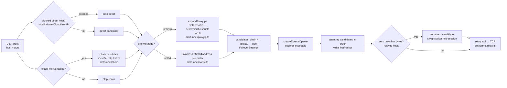

# Q Proxy — Developer Guide

> User-facing deploy and panel docs: [USER_GUIDE.md](USER_GUIDE.md). Frozen contracts: [ARCHITECTURE.md](ARCHITECTURE.md). Agent-facing subsystem map: [../CONTEXT.md](../CONTEXT.md).

## 1. Stack & Principles

| Concern | Choice | Evidence |
|---------|--------|----------|
| Runtime | Cloudflare Workers | `wrangler.toml` `compatibility_date = "2026-08-01"`; `cloudflare:sockets` TCP egress |
| Language | TypeScript strict (`ES2023`) | `tsconfig.json` (strict, `workers-types`) |
| Build | esbuild single-file `dist/q-proxy.js` | `scripts/build-single-file.mjs` — `format: esm`, `platform: browser`, loader `.html → text`, `define __APP_VERSION__` |
| Deps | Zero runtime deps | `package.json` devDeps only; build asserts no bare imports except `cloudflare:*` |
| Storage | One KV namespace (`QPROXY_KV`) | `wrangler.toml`, `src/types/env.ts` — no D1/DO |
| Tests | vitest 2 projects | `vitest.config.ts` — `unit` (node) + `workers` (`@cloudflare/vitest-pool-workers`) |

Ground rules (`ARCHITECTURE.md §0`): compat `2026-08-01` forces `binaryType = "arraybuffer"` on every server socket; parsers never throw (`Result` convention); named exports only; no comments in impl — rationale lives here.

## 2. Getting Started

```bash
npm install          # devDeps: typescript, esbuild, vitest, wrangler, @cloudflare/workers-types
npm run typecheck    # tsc --noEmit — must pass per DoD
npm test             # vitest run — both projects, see §3
npm run dev          # wrangler dev → http://127.0.0.1:8787 (miniflare, KV in-memory)
npm run build        # esbuild → dist/q-proxy.js (dashboard-pasteable)
npm run deploy       # build + wrangler deploy
```

Gotcha: `wrangler dev` serves `dist/q-proxy.js` (per `wrangler.toml main=`). Source edits are invisible until you rebuild.

## 3. Testing

### 3.1 Runner

`vitest.config.ts` defines two projects:

```ts
projects: [
  { name: 'unit',    environment: 'node', include: ['test/**/*.spec.ts'], exclude: ['test/workers/**'] },
  { name: 'workers', include: ['test/workers/**/*.spec.ts'],
    miniflare: { compatibilityDate: '2026-08-01', kvNamespaces: ['QPROXY_KV'] } }
]
```

| Command | What runs |
|---------|-----------|
| `npm test` | Both projects (763 tests at time of writing) |
| `npx vitest run --project=unit` | Pure logic — no workerd needed (`src/core/**` may not import `cloudflare:*`) |
| `npx vitest run --project=workers` | Real `fetch` through `src/worker.ts` with `fetchMock` for DoH/remote-subs |

Layout rule: specs mirror `src/` — `src/protocols/vless.ts` ⇔ `test/protocols/vless.spec.ts`, `src/handlers/api/settings.ts` ⇔ `test/workers/handlers/api/settings.spec.ts`.

### 3.2 Coverage Map

| Group | Project | Example |
|-------|---------|---------|
| Crypto (MD5, SHA-224, AES-CFB, HKDF, EVP_BytesToKey, X25519, ChaCha20) | unit | RFC vectors in `test/crypto/*` |
| Protocol parsers (chunk-split `push()`, 16 KiB/10 s caps, reject paths) | unit | Synthetic frames per `docs/research/04-protocol-formats.md` |
| Share URIs + emitters (golden snapshots) | unit | `test/nodes/emitters/*.spec.ts` |
| WARP parsers/formatters, x25519 keypairs | unit | `test/warp/*` |
| Settings migrate/validate/seed, UA, proxyIP/NAT64, failover planner | unit | Mocked `fetch` for DoH/TXT |
| Router/auth/KV/sub/tunnel smoke (injectable `dialImpl`) | workers | `test/workers/core/router.spec.ts`, `test/workers/handlers/*` |

### 3.3 Testing Protocol Changes

Protocol work is highest-risk — validate against **Xray-core vectors**, not just unit synthetics:

1. Add/update the unit spec with frame bytes from Xray `proxy/vless`, `proxy/vmess`, `proxy/trojan`, `proxy/shadowsocks` test fixtures (AEAD-only VMess, SIP002 SS).
2. Assert `reject` → WS `1008` (never leaks reason), `need-more` on split chunks, `ready.parsed` + correct `rest` and `responseHeader()`.
3. Add a `workers` smoke that upgrades via `WebSocketPair` with injectable `dialImpl` (raw sockets unavailable in the pool).
4. Run `npm run typecheck && npm test`; golden emitter snapshots must not drift without review.

## 4. Architecture

### 4.1 Request Lifecycle

```mermaid
flowchart TD
    A[Client Request] --> B{GET /robots.txt?}
    B -- yes --> R1[handlers/robots.ts<br/>Disallow: /]
    B -- no --> C{identifyTunnel?<br/>src/core/routes.ts}
    C -- "/{vl|vm|tr|ss}/ + suffix [A-Za-z0-9]{8,32}" --> D{WS Upgrade?}
    D -- no --> CAM[handlers/camouflage.ts<br/>fake 1101 HTML 500]
    D -- yes --> K{killSwitch?}
    K -- on --> S503[503 Service Unavailable]
    K -- off --> T[handlers/tunnel.ts<br/>early-data b64url decode ≤2048]
    T --> P[protocols/createXInbound<br/>push → ready / reject→1008]
    P --> SP{speedtest host?}
    SP -- "speed|cp.cloudflare.com" --> SYN[synthetic 204]
    SP -- no --> E[egress makeFailoverStrategy]
    C -- no --> E2{resolveSecureRoute<br/>src/core/routes.ts}
    E2 -- "/{sp}/sub" --> SUB[handlers/subscribe.ts]
    E2 -- "/{sp}/sub/wg/{token}/{format}" --> WSUB[handlers/warp-sub.ts]
    E2 -- "/{sp}/sub/u/{token}" --> USUB[handlers/users-sub.ts]
    E2 -- "/{sp}/doh" --> DOH[handlers/doh.ts]
    E2 -- "/{sp}/my-ip" --> MYIP[handlers/myip.ts<br/>requireAuth]
    E2 -- "/{sp}/api/* or telegram/*" --> API[dispatchApi<br/>auth guard + CSRF]
    E2 -- "/{sp}/panel|/login|root" --> PAGE[panel-page.ts<br/>ASSETS]
    E2 -- null --> CAM
    SUB --> GEN[nodes/generate.ts → ProxyNode[]]
    GEN --> EMI[emitters/registry.ts<br/>EMITTERS format]
```

Route precedence is top-down, first match wins — 28 entries defined in `ARCHITECTURE.md §3`, implemented by `routeRequest` in `src/core/router.ts`, with tunnel dispatch via `identifyTunnel` and secure dispatch via `resolveSecureRoute` + `resolveAuthAlias`. Kill switch is checked before any WebSocket upgrade.

Auth: `q_session` HMAC cookie (`src/auth/session.ts`) + `X-Q-Panel: 1` CSRF header on mutating APIs (`src/auth/guard.ts`). Non-panel failures return camouflage, never 404.

### 4.2 Egress Failover Strategy



Implementation: `makeFailoverStrategy(settings, target)` builds candidates; `createEgressOpener(strategy, dialImpl?)` sequential-walks with a default dial that writes `firstPacket` eagerly. Zero-byte retry is triggered by `relay.ts`, not `egress.ts` itself.

### 4.3 Emitter Pipeline

```mermaid
flowchart TD
    REQ[GET /{sp}/sub<br/>pickSubFormat: target param > classifyUA > base64<br/>browser → info page] --> GEN[generateNodes<br/>protocols×addresses×ports×variants<br/>invariants: security↔port, fragment→TLS only, SS earlyData=0]

    GEN --> MERG{format base64?}
    MERG -- yes --> REM[merge.ts: fetchRemoteSubLines<br/>timeout/cap/b64 autodetect/dedupe]
    MERG -- no --> EMI
    REM --> EMI

    EMI[registry: base64-list · clash-yaml · singbox-json · surge-conf · loon-conf] --> H[subscriptionHeaders<br/>Profile-Title · Subscription-Userinfo · Content-Disposition]
    H --> RESP[Response<br/>edge Cache API 60s keyed format+mode]
```

Routing-rule settings inject Clash/sing-box rule sections at emit time (bypass-LAN, block QUIC/ads/malware, custom suffix lists). URI grammars live in `src/nodes/share-uri.ts`; remark naming in `src/nodes/naming.ts`.

Node-generation caveats: a `cleanIps` entry with an explicit `:port` pins that port only, and its security is inferred purely from `CF_TLS_PORTS` membership — a pinned port outside both CF port families still emits (as `security: "none"`) but is unreachable in practice; keep pinned ports inside {443,2053,2083,2087,2096,8443} ∪ {80,8080,8880,2052,2082,2086,2095}.

Remote-sub merge accepts **share-link lines only** (`vless://`/`vmess://`/`trojan://`/`ss://`/`hysteria2://`, raw or base64-wrapped) — `src/subscription/merge.ts` drops everything else by design, so a remote URL serving Clash YAML contributes zero lines. Merged lines flow into the base64 format only.

## 5. KV Schema

Namespace binding `QPROXY_KV`.

| Key | Shape | Writer | TTL / Cache |
|-----|-------|--------|-------------|
| `qproxy:settings` | `{version, updatedAt, data:Settings}` | `src/settings/store.ts:saveSettings` | Isolate cache 60 s + KV `cacheTtl:60`; save invalidates |
| `qproxy:meta` | `{createdAt, installedVersion}` | `store.ts:ensureInitialized` (once) | — |
| `qproxy:counters` | `{day, requestsToday, requestsTotal, updatedAt}` | `src/core/counters.ts:recordConnection` | Buffered per-isolate; flush >60 s or every 32 conns |
| `qproxy:users` | JSON array of ≤50 user records (token, protocols, quota, expiry) | `src/users/store.ts` | Read per admin request / sub hit |
| `qproxy:user-usage:{yyyy-mm-dd}` | per-user daily hit counts | `src/users/store.ts` | Day-keyed |
| `qproxy:warp:account:{id}` / `qproxy:warp:token:{token}` / `qproxy:warp:presets` / `qproxy:warp:global` | WARP device + preset state | `src/warp/store.ts` | Two-key write with rollback |

Sessions are stateless HMAC cookies — no session records in KV. Sensitive paths `passwordHash`, `passwordSalt`, `sessionSecret` (plus write-only `telegram.botToken`) never leave authenticated views.

### Migrations

`src/settings/migrate.ts:migrateSettings(raw)` — pure, no IO:

1. Non-object or missing `version` → `structuredClone(DEFAULT_SETTINGS)` + seed identity.
2. `version === SETTINGS_VERSION` → deep-merge stored data over a clone of defaults (fills new keys).
3. `version < SETTINGS_VERSION` → apply `MIGRATIONS[v]` sequentially then rule 2.
4. `version > SETTINGS_VERSION` (downgrade) → rule 2 + warning log.

Bump `SETTINGS_VERSION` and add one migration entry per settings shape change.

## 6. Adding a New Emitter

Example: adding a `quantumult` Worker-subscription format:

1. **Types:** extend `SubFormat` in `src/core/ua.ts`; add tokens to `classifyUA` if needed.
2. **Emitter:** create `src/nodes/emitters/quantumult-conf.ts` exporting `(nodes, opts: EmitOptions): string`; use `opts.isFragment` to filter variant nodes; bracket IPv6.
3. **Registry:** register in `src/nodes/emitters/registry.ts`.
4. **Negotiation:** add the format to `SUB_FORMATS` in `src/subscription/negotiate.ts` — the single source of the format list, consumed by both `handlers/subscribe.ts` and `handlers/users-sub.ts`. There is no separate `FORMATS` table anymore.
5. **Tests:** golden snapshot in `test/nodes/emitters/quantumult-conf.spec.ts`, UA case in `test/core/ua.spec.ts`, workers sub test asserting `Content-Type` + `Content-Disposition: attachment`.
6. **Verify:** `npm run typecheck && npm test` — both projects green; no new runtime dep.

Keep emitters pure — no KV, no `fetch`, no `cloudflare:*` imports, so they stay in the `unit` project. Wire-format changes alter emitter output on purpose: goldens break; get owner sign-off first.

Adding a **WARP** format follows the same shape via `src/warp/formats/`: implement `(ctx: WarpEmitContext) => string | Uint8Array` and register it in `WARP_FORMATS` + `WARP_EMITTERS` + content-type/extension maps in `src/warp/formats/registry.ts`.

## 7. Project Conventions

- **Error handling:** throw `AppError` subclasses (`src/core/errors.ts`) — `worker.ts` single boundary renders the JSON envelope for `/api/*` else sanitized HTML. Tunnel plane: `reject` → WS close `1008`; infra failure → `1011`.
- **Early data:** `src/tunnel/websocket.ts` extracts the `Sec-WebSocket-Protocol` b64url payload (≤ `earlyDataMaxBytes`), ignores it for SS; handshake buffer capped 16 KiB / 10 s.
- **Logging:** `src/core/log.ts` debug-gated with request id; never logs deny-list material (passwords, hashes, UUIDs, session secrets, securePath free-text).
- **Camouflage:** `src/handlers/camouflage.ts` — identical fake-1101 body for wrong path / unknown route / internal error; `/robots.txt` always `Disallow: /`.

## 8. References

- Architecture: [ARCHITECTURE.md](ARCHITECTURE.md) — frozen types, route table (§3), data flows (§4), KV (§5), build (§8)
- Agent map: [../CONTEXT.md](../CONTEXT.md) — subsystem index + conventions cheat-sheet
- Research: `docs/research/01-bpb-panel.md` … `04-protocol-formats.md`
- Deploy auth: Cloudflare Global API Key env vars (see [../README.md](../README.md))

## 9. Protocol Internals (src/protocols/)

| File | Export | Semantics |
|------|--------|-----------|
| common.ts | `ProtocolInbound<R>`, `PushOutcome`, `parseAddress` | push(data) → need-more / ready{parsed, rest} / reject; responseHeader() once |
| vless.ts | `createVlessInbound(uuid)` | Verifies 16-byte UUID; cmd 1 tcp, cmd 2 udp port 53 only → DnsPacketRelay; rejects MUX cmd 3; header `[ver, 0x00]` |
| trojan.ts | `createTrojanInbound(password)` | First 56 bytes == lowercase hex SHA-224(password) then CRLF; SOCKS-ish addr parse; cmd ≠ 1 rejected |
| vmess-crypto.ts | auth-id + AEAD helpers | WebCrypto GCM, MD5 KDF chain (pure-JS md5.ts), ±120 s time window |
| vmess.ts | `createVmessInbound(uuid)` | AEAD-only (alterId 0) over legacy AES-CFB header decode; rejects non-AEAD |
| shadowsocks.ts | `createSSInbound(method,password)` | EVP_BytesToKey(MD5) master → HKDF-SHA1 subkey; AEAD chunks ≤0x3FFF; little-endian nonce increment (SIP004); early data ignored |

Handshake bounded: 16 KiB accumulated + 10 s timeout → WS close 1008. Reasons logged server-side only.

## 10. Settings Store (src/settings/)

- store.ts: `loadSettings(env)` with 60 s isolate cache; `saveSettings` validates then deep-merges; `ensureInitialized` seeds securePath + UUIDs + sessionSecret once.
- seed.ts: `randomHex(12)` securePath, `randomUUID()` for empty UUIDs, 24-char passwords.
- validate.ts: full-schema validation → `{ok:false, fields}` map for 422 responses.
- migrate.ts: pure stepwise migrations — see §5.

## 11. Observability

- log.ts: debug-gated structured logging with request id; redaction deny-list asserted in tests.
- counters.ts: `readUsage`/`recordConnection` with isolate-buffered flush; the `Subscription-Userinfo` estimate derives from it (`download ≈ requestsTotal × 1 MiB`).

## 12. Local Development Tips

- Miniflare auto-creates in-memory KV; a dummy id in `wrangler.toml` is fine locally.
- Test early data locally: client must send `Sec-WebSocket-Protocol: base64url(firstFrame)` and `ed=2048` in the URI.
- Fragment testing: set `fragment.mode=low`, request `?target=clash&mode=fragment`; fragment params appear only there.
- If `wrangler dev` wedges (workerd accepts connections but never responds), kill the stray workerd process and relaunch on another port (`npx wrangler dev --port 8788`).

## 13. Build Reproducibility

`scripts/build-single-file.mjs` bundles `src/worker.ts` with esbuild (bundle, esm, browser, es2023, minify, `.html`→text, `__APP_VERSION__` define). Post-build asserts no bare imports except `cloudflare:*` and writes `dist/q-proxy.js` (~400 KB). Same artifact for dashboard paste and wrangler deploy.

## 14. FAQ for Contributors

- Why no comments in impl? Rationale lives in `ARCHITECTURE.md`; impl stays auditable without annotation drift.
- Why no D1/DO? Owner decision — KV-only keeps the single-file story; eventual consistency is documented where it matters (login throttle, kill-switch propagation ≤ cache window).
- Adding a route? Requires an architecture revision: update `ARCHITECTURE.md §3` + `src/core/router.ts` + `test/workers/router.spec.ts`.

## 15. File Ownership (ARCHITECTURE.md §9)

| Wave | Owner | Files |
|------|-------|-------|
| A | Scaffold | package.json, tsconfig, vitest.config.ts, wrangler.toml, types/*, core/* |
| B | Protocols | crypto/*, protocols/* |
| C | Tunnel | tunnel/*, handlers/tunnel, doh |
| D | Subs | nodes/*, subscription/*, handlers/subscribe |
| E | Glue | worker.ts, core/router.ts, settings/*, auth/*, handlers/api/*, users/, warp/ |
| F | UI | ui/assets.ts, *.html |

Cross-imports only via frozen symbols. Adding a file outside ownership requires an architecture revision.

## 16. API Contract (consumed by ui/assets.ts)

Success envelope `{ok:true,data:…}`; failure `{ok:false,error:{code,message},fields?}`. Key endpoints (session unless noted):

- `POST api/auth/login` `{password}` → sets `q_session`; `POST api/auth/setup` accepted only while password unset
- `GET api/settings` → redacted view; `PUT api/settings` (CSRF) → `{saved:true}` or 422 `{fields}`; `POST api/settings/reset`
- `GET api/settings/export` → secrets-stripped JSON; `POST api/settings/import`
- `GET api/bootstrap` → `{settings, status, subUrls}` aggregate with ETag/304
- `GET api/status`; `POST api/killswitch {enabled}`; `GET api/suburls`; `GET api/version/check`
- `ANY api/warp/{…}` → accounts/presets/amnezia sub-dispatch
- `ANY api/users/{…}` → user CRUD + token regeneration
- `POST telegram/setup` / `telegram/remove` (session+CSRF); `POST telegram/webhook/{secret}` (public, HMAC-gated)

Method guards live in `dispatchApi`; `OPTIONS` on APIs → 405.

Two validation tiers exist — pick by surface:

- **Settings framework** (`src/settings/validate.ts`): `validateSettings(input)` walks the whole schema and returns `{ok:true,value}` / `{ok:false,fields}`; handlers throw `ValidationError(result.fields)`. Use for anything stored in `qproxy:settings`.
- **API-handler inline** (`handlers/api/{users,warp,auth,status}.ts`): local `requireString`-style helpers over `readJsonObject(req)` that throw `ValidationError({field: msg})` per field. Use for request-scoped payloads that never touch the Settings schema.

Both funnel into the same 422 envelope `{ok:false,error:{code:"VALIDATION"},fields}`.

## 17. Contributor Troubleshooting

| Symptom | Cause | Fix |
|---------|-------|-----|
| Source edit has no effect in `wrangler dev` | dev serves `dist/q-proxy.js` | Run `npm run build` first |
| workerd accepts connections but never responds | wedged session | Kill stray workerd; relaunch on another port |
| KV reads return stale settings | 60 s isolate/KV cache window | `invalidateSettingsCache()` or wait out the TTL |
| Golden emitter test fails | wire-format output changed | Intentional breakage — review diff, then update snapshot |
| Port mismatch assertion | security/port pairing violated | Fix generator: tls ⇔ TLS port family |

## 18. Performance Notes

- Settings: 60 s isolate cache + KV `cacheTtl:60` + write-through with no-op skip — typical request ≤1 KV read.
- Counters buffered 60 s / 32 connections; usage reads memoized 15 s.
- Subscription responses edge-cached 60 s via Cache API, keyed by format+mode; WARP subs purged on account/preset/amnezia changes.
- DoH resolver caches proxyIP A/AAAA/TXT expansions 10 min per isolate.

## 19. Versioning

Version comes from git tags (`node scripts/version.mjs`); the build stamps it as `__APP_VERSION__`, displayed by `GET api/status`. `SETTINGS_VERSION = 1` in `src/types/settings.ts` — bump with a migration entry per §5. Release gate: `node scripts/release.mjs <version>` runs typecheck + tests + changelog check before tagging.

## 20. Checklist Before PR

- [ ] `npm run typecheck` passes
- [ ] `npm test` passes (unit + workers)
- [ ] No new runtime dependency added
- [ ] No bare import except `cloudflare:*`
- [ ] Route additions updated `ARCHITECTURE.md §3` + `test/workers/router.spec.ts`
- [ ] Sensitive paths not logged or returned by `GET api/settings`
- [ ] Mermaid diagrams updated if routing/egress changed

## 21. Where to Read Next

- Start with `src/core/router.ts` + `src/core/routes.ts` + `src/tunnel/egress.ts` — the three load-bearing modules.
- Then `src/protocols/common.ts` for the inbound contract and `src/nodes/emitters/registry.ts` for the subscription surface.
- Then [../CONTEXT.md](../CONTEXT.md) for the full subsystem map.
