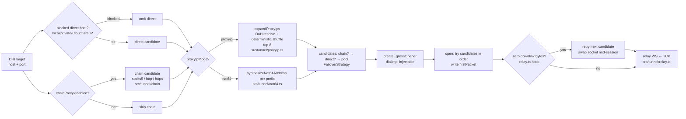

# Q Proxy — Developer Guide

> User-facing deploy and panel docs: [USER_GUIDE.md](USER_GUIDE.md). Frozen contracts: [ARCHITECTURE.md](ARCHITECTURE.md). Agent-facing subsystem map: [../CONTEXT.md](../CONTEXT.md).

## 1. Stack & Principles

| Concern | Choice | Evidence |
|---------|--------|----------|
| Runtime | Cloudflare Workers | `wrangler.toml` `compatibility_date = "2026-08-01"`; `cloudflare:sockets` TCP egress |
| Language | TypeScript strict (`ES2023`) | `tsconfig.json` (strict, `workers-types`) |
| Build | esbuild single-file `dist/q-proxy.js` | `scripts/build-single-file.mjs` — `format: esm`, `platform: browser`, loader `.html → text`, `define __APP_VERSION__` |
| Deps | Zero runtime deps | `package.json` devDeps only; build asserts no bare imports except `cloudflare:*` |
| Storage | KV (`QPROXY_KV`) for settings/WARP/throttle/session/ratelimit + D1 (`QPROXY_DB`, `migrations/0001_init.sql`) for write-hot state | `wrangler.toml`, `src/types/env.ts`, `src/users/store.ts:bootstrapD1` |
| Tests | vitest 2 projects | `vitest.config.ts` — `unit` (node) + `workers` (`@cloudflare/vitest-pool-workers`) |

Ground rules (`ARCHITECTURE.md §0`): compat `2026-08-01` forces `binaryType = "arraybuffer"` on every server socket; parsers never throw (`Result` convention); named exports only; no comments in impl — rationale lives here.

## 2. Getting Started

```bash
npm install          # devDeps: typescript, esbuild, vitest, wrangler, @cloudflare/workers-types
npm run typecheck    # tsc --noEmit — must pass per DoD
npm test             # vitest run — both projects, see §3
npm run dev          # wrangler dev → http://127.0.0.1:8787 (miniflare, KV in-memory)
npm run build        # esbuild → dist/q-proxy.js (dashboard-pasteable)
npm run deploy       # build + wrangler deploy
```

Gotcha: `wrangler dev` serves `dist/q-proxy.js` (per `wrangler.toml main=`). Source edits are invisible until you rebuild.

## 3. Testing

### 3.1 Runner

`vitest.config.ts` defines two projects:

```ts
projects: [
  { name: 'unit',    environment: 'node', include: ['test/**/*.spec.ts'], exclude: ['test/workers/**', 'test/d1/**'] },
  { name: 'workers', include: ['test/workers/**/*.spec.ts', 'test/d1/**/*.spec.ts'],
    miniflare: { compatibilityDate: '2026-08-01', kvNamespaces: ['QPROXY_KV'], d1Databases: ['QPROXY_DB'] } }
]
```

D1-backed specs live in `test/d1/` (KV→D1 migration, D1 store paths) and run in the `workers` project against a provisioned `QPROXY_DB`. Helpers in `test/helpers/seed.ts`: `applyD1Schema(db)`, `resetD1(db)` (empties all seven tables), `seedLegacyKvForMigration(kv)` / `clearLegacyKvForMigration(kv)` for migration fixtures.

| Command | What runs |
|---------|-----------|
| `npm test` | Both projects (763 tests at time of writing) |
| `npx vitest run --project=unit` | Pure logic — no workerd needed (`src/core/**` may not import `cloudflare:*`) |
| `npx vitest run --project=workers` | Real `fetch` through `src/worker.ts` with `fetchMock` for DoH/remote-subs |

Layout rule: specs mirror `src/` — `src/protocols/vless.ts` ⇔ `test/protocols/vless.spec.ts`, `src/handlers/api/settings.ts` ⇔ `test/workers/handlers/api/settings.spec.ts`.

### 3.2 Coverage Map

| Group | Project | Example |
|-------|---------|---------|
| Crypto (MD5, SHA-224, AES-CFB, HKDF, EVP_BytesToKey, X25519, ChaCha20) | unit | RFC vectors in `test/crypto/*` |
| Protocol parsers (chunk-split `push()`, 16 KiB/10 s caps, reject paths) | unit | Synthetic frames per `docs/research/04-protocol-formats.md` |
| Share URIs + emitters (golden snapshots) | unit | `test/nodes/emitters/*.spec.ts` |
| WARP parsers/formatters, x25519 keypairs | unit | `test/warp/*` |
| Settings migrate/validate/seed, UA, proxyIP/NAT64, failover planner | unit | Mocked `fetch` for DoH/TXT |
| Router/auth/KV/sub/tunnel smoke (injectable `dialImpl`) | workers | `test/workers/core/router.spec.ts`, `test/workers/handlers/*` |
| D1 stores + KV→D1 migration (provisioned `QPROXY_DB`) | workers | `test/d1/migrate.spec.ts`, `test/helpers/seed.ts` fixtures |

### 3.3 Testing Protocol Changes

Protocol work is highest-risk — validate against **Xray-core vectors**, not just unit synthetics:

1. Add/update the unit spec with frame bytes from Xray `proxy/vless`, `proxy/vmess`, `proxy/trojan`, `proxy/shadowsocks` test fixtures (AEAD-only VMess, SIP002 SS).
2. Assert `reject` → WS `1008` (never leaks reason), `need-more` on split chunks, `ready.parsed` + correct `rest` and `responseHeader()`.
3. Add a `workers` smoke that upgrades via `WebSocketPair` with injectable `dialImpl` (raw sockets unavailable in the pool).
4. Run `npm run typecheck && npm test`; golden emitter snapshots must not drift without review.

## 4. Architecture

### 4.1 Request Lifecycle

```mermaid
flowchart TD
    A[Client Request] --> B{GET /robots.txt?}
    B -- yes --> R1[handlers/robots.ts<br/>Disallow: /]
    B -- no --> C{identifyTunnel?<br/>src/core/routes.ts}
    C -- "/{vl|vm|tr|ss}/ + suffix [A-Za-z0-9]{8,32}" --> D{WS Upgrade?}
    D -- no --> CAM[handlers/camouflage.ts<br/>fake 1101 HTML 500]
    D -- yes --> K{killSwitch?}
    K -- on --> S503[503 Service Unavailable]
    K -- off --> T[handlers/tunnel.ts<br/>early-data b64url decode ≤2048]
    T --> P[protocols/createXInbound<br/>push → ready / reject→1008]
    P --> SP{speedtest host?}
    SP -- "speed|cp.cloudflare.com" --> SYN[synthetic 204]
    SP -- no --> E[egress makeFailoverStrategy]
    C -- no --> E2{resolveSecureRoute<br/>src/core/routes.ts}
    E2 -- "/{sp}/sub" --> SUB[handlers/subscribe.ts]
    E2 -- "/{sp}/sub/wg/{token}/{format}" --> WSUB[handlers/warp-sub.ts]
    E2 -- "/{sp}/sub/u/{token}" --> USUB[handlers/users-sub.ts]
    E2 -- "/{sp}/doh" --> DOH[handlers/doh.ts]
    E2 -- "/{sp}/my-ip" --> MYIP[handlers/myip.ts<br/>requireAuth]
    E2 -- "/{sp}/api/* or telegram/*" --> API[dispatchApi<br/>auth guard + CSRF]
    E2 -- "/{sp}/panel|/login|root" --> PAGE[panel-page.ts<br/>ASSETS]
    E2 -- null --> CAM
    SUB --> GEN[nodes/generate.ts → ProxyNode[]]
    GEN --> EMI[emitters/registry.ts<br/>EMITTERS format]
```

Route precedence is top-down, first match wins — 28 entries defined in `ARCHITECTURE.md §3`, implemented by `routeRequest` in `src/core/router.ts`, with tunnel dispatch via `identifyTunnel` and secure dispatch via `resolveSecureRoute`. Kill switch is checked before any WebSocket upgrade.

Auth: `q_session` HMAC cookie (`src/auth/session.ts`) + `X-Q-Panel: 1` CSRF header on mutating APIs (`src/auth/guard.ts`). Non-panel failures return camouflage, never 404.

### 4.2 Egress Failover Strategy



Implementation: `makeFailoverStrategy(settings, target)` builds candidates; `createEgressOpener(strategy, dialImpl?, opts?)` sequential-walks with a default dial that writes `firstPacket` eagerly. Walks are capped by a 15 s total dial budget (`TOTAL_DIAL_BUDGET_MS`, overridable via `EgressOpenerOptions.totalBudgetMs`) so hanging candidates can't stack N× per-dial timeouts. `openEgressWithSpeculativeDirect` starts the synchronously-known prefix dials (chain + direct) before proxyIP/NAT64 tail expansion finishes and reuses them in the opener; late sockets that lose the race are closed. Zero-byte retry is triggered by `relay.ts`, not `egress.ts` itself.

### 4.3 Emitter Pipeline

```mermaid
flowchart TD
    REQ[GET /{sp}/sub<br/>pickSubFormat: target param > classifyUA > base64<br/>browser → info page] --> GEN[generateNodes<br/>protocols×addresses×ports×variants<br/>invariants: security↔port, fragment→TLS only, SS earlyData=0]

    GEN --> MERG{format base64?}
    MERG -- yes --> REM[merge.ts: fetchRemoteSubLines<br/>timeout/cap/b64 autodetect/dedupe]
    MERG -- no --> EMI
    REM --> EMI

    EMI[registry: clash-yaml · singbox-json · surge-conf · loon-conf · quantumult-conf<br/>base64 renders in subscription/render.ts] --> H[subscriptionHeaders<br/>Profile-Title · Subscription-Userinfo · Content-Disposition]
    H --> RESP[Response<br/>edge Cache API 60s keyed format+mode+settings-version]
```

Routing-rule settings inject Clash/sing-box rule sections at emit time (bypass-LAN, block QUIC/ads/malware, custom suffix lists). URI grammars live in `src/nodes/share-uri.ts`; remark naming in `src/nodes/naming.ts`. Flow/direct stamping: `generateNodes` copies `settings.vlessFlow` onto TLS VLESS nodes only (`flow: null` on plain nodes, legacy output byte-identical when the setting is empty) and marks every SS node `direct` when `settings.ssDirect` is on; `buildVlessShareUri` appends `flow=` after the transport params, `buildSSShareUri` emits a plugin-free `ss://` URI when direct; clash/sing-box emitters add `flow` / drop the v2ray-plugin keys accordingly (surge/loon untouched). sing-box DNS is typed servers by default: `proxy-dns` `{type, server, detour: "PROXY"}` with `domain_resolver: "local-dns"` for domain-hosted upstreams, non-default `server_port`/`path` preserved, `local-dns` `{type: "local"}` — no `address` keys remain (see `dnsServerEntry` in `src/nodes/emitters/singbox-json.ts`).

Node-generation caveats: a `cleanIps` entry with an explicit `:port` pins that port only, and its security is inferred purely from `CF_TLS_PORTS` membership — a pinned port outside both CF port families still emits (as `security: "none"`) but is unreachable in practice; keep pinned ports inside {443,2053,2083,2087,2096,8443} ∪ {80,8080,8880,2052,2082,2086,2095}.

Remote-sub merge accepts **share-link lines only** (`vless://`/`vmess://`/`trojan://`/`ss://`/`hysteria2://`, raw or base64-wrapped) — `src/subscription/merge.ts` drops everything else by design, so a remote URL serving Clash YAML contributes zero lines. Merged lines flow into the base64 format only.

## 5. KV Schema

Namespace binding `QPROXY_KV`.

| Key | Shape | Writer | TTL / Cache |
|-----|-------|--------|-------------|
| `qproxy:settings` | `{version, updatedAt, data:Settings}` | `src/settings/store.ts:saveSettings` | Isolate cache 60 s + KV `cacheTtl:60`; save invalidates |
| `qproxy:meta` | `{createdAt, installedVersion}` | `store.ts:ensureInitialized` (once) | — |
| `qproxy:counters` | `{day, requestsToday, requestsTotal, updatedAt}` | `src/core/counters.ts:recordConnection` | Buffered per-isolate; flush >60 s or every 32 conns |
| `qproxy:users` | JSON array of ≤50 user records (token, protocols, quota, expiry) | `src/users/store.ts` | Read per admin request / sub hit |
| `qproxy:user-usage:{yyyy-mm-dd}:{hash}` | per-user daily hit counter (per-hash key; legacy `qproxy:user-usage:{yyyy-mm-dd}` array still read for same-day migration) | `src/users/store.ts` | Day-keyed |
| `qproxy:user-activity:{yyyy-mm-dd}:{hash}` | per-user daily activity row `{day, requests, bytesUp, bytesDown}` (never plaintext tokens; corrupt rows read as zeros) | `src/users/store.ts:recordUserActivity` (in-isolate deltas, flush every 32 ops / 60 s) | Day-keyed, no TTL |
| `qproxy:ratelimit:{hash}:{window}` | per-user rate-limit bucket `{tokens, updatedAt}` (1-min window stamp) | `src/users/ratelimit.ts:tryConsume` | 120 s TTL, fail-open on KV error |
| `qproxy:warp:account:{id}` / `qproxy:warp:token:{token}` / `qproxy:warp:presets` / `qproxy:warp:global` | WARP device + preset state | `src/warp/store.ts` | Two-key write with rollback |

Sessions are stateless HMAC cookies — no session records in KV. Sensitive paths `passwordHash`, `passwordSalt`, `sessionSecret` (plus write-only `telegram.botToken`) never leave authenticated views.

### D1 database (binding `QPROXY_DB`)

Write-hot state lives in D1, schema in `migrations/0001_init.sql` (mirrored by exported `D1_SCHEMA` in `src/users/store.ts`):

| Table | Rows | Writer |
|-------|------|--------|
| `users` | User directory (≤50): id, name, token_hash (unique), token_hint, enabled, expires_at, daily_req_limit, protocols (JSON), address_override (JSON), created_at | `src/users/store.ts` (D1-first, KV fallback when unbound) |
| `user_totals` | Lifetime hits per token_hash | same (single UPSERT) |
| `user_usage` | Daily hits per (day, token_hash) | same (single UPSERT — quota check + increment in one statement) |
| `user_activity` | Daily `{requests, bytes_up, bytes_down}` per (day, token_hash) | same (buffered deltas, flushed as one UPSERT) |
| `counters` | Single row (`id = 1`): day, requests_today/total, bytes_up/down | `src/core/counters.ts:flushD1` (SELECT + UPSERT batch; KV fallback on error) |
| `audit_log` | `{ts, ip, action, detail}` rows | `src/core/log.ts:audit` (via `waitUntil`; context bound through `bindCounterContext`) |
| `meta` | Migration guard `kv_migrated_v1` | `bootstrapD1` |

Rules: all increments are single-statement `ON CONFLICT … DO UPDATE` UPSERTs (no read-modify-write, race-free across isolates). On boot, `ensureInitialized` → `bootstrapD1` runs `ensureD1Schema` then copies any legacy KV user/counter keys into D1 exactly once (guard row `meta.kv_migrated_v1`) and deletes the legacy keys. `StoreEnv` (`{QPROXY_KV, QPROXY_DB?}`) is the store-layer env type so unit-adjacent callers stay D1-optional; the production `Env` requires `QPROXY_DB`.

### Migrations

`src/settings/migrate.ts:migrateSettings(raw)` — pure, no IO:

1. Non-object or missing `version` → `structuredClone(DEFAULT_SETTINGS)` + seed identity.
2. `version === SETTINGS_VERSION` → deep-merge stored data over a clone of defaults (fills new keys).
3. `version < SETTINGS_VERSION` → apply `MIGRATIONS[v]` sequentially then rule 2.
4. `version > SETTINGS_VERSION` (downgrade) → rule 2 + warning log.

Bump `SETTINGS_VERSION` and add one migration entry per settings shape change.

## 6. Adding a New Emitter

Reference (as-built): the `quantumult` format shipped exactly through this pipeline — use it as the template for the next emitter:

1. **Types:** extend `SubFormat` in `src/core/ua.ts`; add tokens to `classifyUA` if needed (`quantumult` uses `quantumult`/`quanx`, sniffed after surge, before loon).
2. **Emitter:** create `src/nodes/emitters/quantumult-conf.ts` exporting `(nodes, opts: EmitOptions): string`; use `opts.isFragment` to filter variant nodes; bracket IPv6.
3. **Registry:** register in `src/nodes/emitters/registry.ts` (`EMITTERS` now covers five sync formats).
4. **Negotiation:** add the format to `SUB_FORMATS` in `src/subscription/negotiate.ts` — the single source of the format list, consumed by both `handlers/subscribe.ts` and `handlers/users-sub.ts`. There is no separate `FORMATS` table anymore.
5. **Serving one-liners:** add the content type in `SUB_CONTENT_TYPES` (`src/subscription/render.ts`), the file extension in `EXTENSIONS` (`src/subscription/headers.ts`), the display label in `FORMAT_LABELS` (`src/handlers/subscribe.ts`), and a `?target=` entry in `buildSubUrls` (`src/handlers/api/status.ts`).
6. **Tests:** golden snapshot in `test/nodes/emitters/quantumult-conf.spec.ts`, UA case in `test/core/ua.spec.ts`, registry-key assertion in `test/nodes/emitters/registry.spec.ts`, content-type/extension cases in `test/subscription/render.spec.ts` + `headers.spec.ts`, suburls count in `test/workers/auth-flow.spec.ts`.
7. **Verify:** `npm run typecheck && npm test` — both projects green; no new runtime dep.

Keep emitters pure — no KV, no `fetch`, no `cloudflare:*` imports, so they stay in the `unit` project. Wire-format changes alter emitter output on purpose: goldens break; get owner sign-off first.

Adding a **WARP** format follows the same shape via `src/warp/formats/`: implement `(ctx: WarpEmitContext) => string | Uint8Array` and register it in `WARP_FORMATS` + `WARP_EMITTERS` + content-type/extension maps in `src/warp/formats/registry.ts`.

## 7. Project Conventions

- **Error handling:** throw `AppError` subclasses (`src/core/errors.ts`) — `worker.ts` single boundary renders the JSON envelope for `/api/*` else sanitized HTML. Tunnel plane: `reject` → WS close `1008`; infra failure → `1011`.
- **Early data:** `src/tunnel/websocket.ts` extracts the `Sec-WebSocket-Protocol` b64url payload (≤ `earlyDataMaxBytes`), ignores it for SS; handshake buffer capped 16 KiB / 10 s.
- **Logging:** `src/core/log.ts` debug-gated with request id; never logs deny-list material (passwords, hashes, UUIDs, session secrets, securePath free-text).
- **Camouflage:** `src/handlers/camouflage.ts` — identical fake-1101 body for wrong path / unknown route / internal error; `/robots.txt` always `Disallow: /`.
- **Relay admission gate:** `RelayOptions.gate?: () => Promise<boolean | {allowed, retryAfterMs?}>` is consulted once at relay start; throw ⇒ allow (fail-open), deny ⇒ `finish(1008)`. Token-bucket state lives in `src/users/ratelimit.ts` (`ratelimitKey`/`consumeBucket` pure, `tryConsume` KV-backed, 30/min + burst 10, 120 s TTL) — pass it in via `gate`, the relay never imports KV itself.

## 8. References

- Architecture: [ARCHITECTURE.md](ARCHITECTURE.md) — frozen types, route table (§3), data flows (§4), KV (§5), build (§8)
- Agent map: [../CONTEXT.md](../CONTEXT.md) — subsystem index + conventions cheat-sheet
- Research: `docs/research/01-bpb-panel.md` … `04-protocol-formats.md`
- Transport decisions: `docs/decisions/ADR-006-grpc-feasibility.md` (gRPC DEFER — no trailer/h2 API) · `ADR-007-xhttp-feasibility.md` (XHTTP DEFER — nearest-term, gated on Xray source pin + edge full-duplex probe) · `ADR-008-reality-remote.md` (REALITY termination impossible; remote-reference model specified, parked) · `ADR-009-transport-roadmap.md` (sequence: XHTTP probes → REALITY-remote product call → gRPC parked)
- Deploy auth: Cloudflare Global API Key env vars (see [../README.md](../README.md))

## 9. Protocol Internals (src/protocols/)

| File | Export | Semantics |
|------|--------|-----------|
| common.ts | `ProtocolInbound<R>`, `PushOutcome`, `parseAddress` | push(data) → need-more / ready{parsed, rest} / reject; responseHeader() once |
| vless.ts | `createVlessInbound(uuid)` | Verifies 16-byte UUID; cmd 1 tcp, cmd 2 udp port 53 only → DnsPacketRelay; rejects MUX cmd 3; header `[ver, 0x00]`; vision: substring-matches `xtls-rprx-vision` in the handshake addons (protobuf or raw JSON) on TCP only (UDP keeps the UDP codec) → `bodyCodec()` serves a length-prefixed (`u16be len + payload`) codec — handshake coalesces complete initial frames and seeds the partial tail, 64 KiB buffer cap (overflow resets + null), split frames buffer across `decodeUp` calls, downlink encoder has null header and maps empty/oversize encodes to empty, never throws |
| trojan.ts | `createTrojanInbound(password)` | First 56 bytes == lowercase hex SHA-224(password) then CRLF; SOCKS-ish addr parse; cmd ≠ 1 rejected |
| vmess-crypto.ts | auth-id + AEAD helpers | WebCrypto GCM, MD5 KDF chain (pure-JS md5.ts), ±120 s time window |
| vmess.ts | `createVmessInbound(uuid)` | AEAD-only (alterId 0) over legacy AES-CFB header decode; rejects non-AEAD |
| shadowsocks.ts | `createSSInbound(method,password)` | EVP_BytesToKey(MD5) master → HKDF-SHA1 subkey; AEAD chunks ≤0x3FFF; little-endian nonce increment (SIP004); early data ignored |

Handshake bounded: 16 KiB accumulated + 10 s timeout → WS close 1008. Reasons logged server-side only.

## 10. Settings Store (src/settings/)

- store.ts: `loadSettings(env)` with 60 s isolate cache; `saveSettings` validates then deep-merges; `ensureInitialized` seeds securePath + UUIDs + sessionSecret once. Stored blob carries a monotonic `rev` (bumped via a fresh KV read on every save, returned to callers); all four write paths (save/reset/import/killswitch) merge from `loadSettingsFresh`, not the isolate cache.
- seed.ts: `randomHex(12)` securePath, `randomUUID()` for empty UUIDs, 24-char passwords.
- validate.ts: full-schema validation → `{ok:false, fields}` map for 422 responses. ECH server-name resolution is `resolveEchServerName(settings, sni)`: disabled ⇒ null, manual `echServerName` wins, else `echAuto` derives the domain-shaped SNI (warning string when unresolvable).
- `allowedIps` is a `{kind:"custom"}` descriptor-validated list (trim/dedupe/drop-empty, 64-entry cap; exact IP or v4/v6 CIDR only — hostnames and `ip:port` rejected). Enforcement is `isIpAllowlisted` + a `requireAuth` check after session verification (401 before 403); `s.allowedIps ?? []` keeps old blobs working.
- `vlessFlow` is an `{kind:"enum", allowed:["", "xtls-rprx-vision"]}` descriptor (`VLESS_FLOWS` in `src/settings/fields.ts`, default `""`) and `ssDirect` a `{kind:"bool"}` descriptor (default `false`); both bound in the panel registry with en/fa dicts (`protocols.flow.*`, `protocols.ssDirect.*`). Unknown flow strings and non-boolean `ssDirect` values fail validation with English field errors.
- migrate.ts: pure stepwise migrations — see §5.

## 11. Observability

- log.ts: debug-gated structured logging with request id; redaction deny-list asserted in tests.
- counters.ts: `readUsage`/`recordConnection` with isolate-buffered flush — D1-first (`flushD1` batch), KV fallback on error; the `Subscription-Userinfo` estimate derives from it (`download ≈ requestsTotal × 1 MiB`).
- audit trail: `audit(action, detail, env?)` in `src/core/log.ts` emits a JSON `info` line (`scope:"audit"`) via the `log.info` seam and persists to the D1 `audit_log` table when `env.QPROXY_DB` is present (fire-and-forget through `waitUntil`; wire the context with `bindCounterContext`). Allowlist design — only caller-supplied fields are serialized (`settings.save|reset|import` → `{ip, keys}`, `killswitch` → `{ip, enabled}`, `warp.account.*`/`warp.preset.*` → `{ip, id}`, `warp.amnezia.update` → `{ip}`); never pass values or secrets, only key names/ids/booleans.
- per-user activity: `recordUserActivity(env, tokenOrHash, delta)` buffers `{requests, bytesUp, bytesDown}` per day-key (merges pending + stored on read); `getUserActivity(env, hash, days)` clamps 1–31 (default 7), returns chronological rows with zeros for gaps; `flushPendingUserActivity` + token-regen migration included.

## 12. Local Development Tips

- Miniflare auto-creates in-memory KV; a dummy id in `wrangler.toml` is fine locally.
- Test early data locally: client must send `Sec-WebSocket-Protocol: base64url(firstFrame)` and `ed=2048` in the URI.
- Fragment testing: set `fragment.mode=low`, request `?target=clash&mode=fragment`; fragment params appear only there.
- If `wrangler dev` wedges (workerd accepts connections but never responds), kill the stray workerd process and relaunch on another port (`npx wrangler dev --port 8788`).

## 13. Build Reproducibility

`scripts/build-single-file.mjs` bundles `src/worker.ts` with esbuild (bundle, esm, browser, es2023, minify, `.html`→text, `__APP_VERSION__` define). Post-build asserts no bare imports except `cloudflare:*` and writes `dist/q-proxy.js` (~400 KB). Same artifact for dashboard paste and wrangler deploy.

Panel assembly runs first in the same script: `src/ui/panel/` sources (`shell.html` + 3 markers `<!--panel:head-js-->/<!--panel:css-->/<!--panel:js-->`, `head.js`, `app.css`, 9 JS parts concatenated in fixed order dict→lib→qr→home→warp→users→chrome→settings→actions) are string-spliced into `src/ui/panel.html`, which is git-kept generated output — edit the sources, never the output (see `src/ui/panel/README.md`). The build fails on missing/duplicated/leftover markers and `node --check`s the script blocks; `panel.html` is rewritten only when bytes change. `test/ui/assets.spec.ts` pins this: no markers in the shipped panel, deterministic assembly, committed output in sync with sources. `login.html`/`camo.html` are untouched by this flow.

## 14. FAQ for Contributors

- Why no comments in impl? Rationale lives in `ARCHITECTURE.md`; impl stays auditable without annotation drift.
- Why D1 alongside KV? Write-hot state (user hits, counters, audit rows) raced under KV read-modify-write across isolates; single-statement D1 UPSERTs are race-free. The settings blob stays on KV (single-key read + 60 s isolate cache fits it), as do the WARP store and throttle/session/ratelimit keys.
- Adding a route? Requires an architecture revision: update `ARCHITECTURE.md §3` + `src/core/router.ts` + `test/workers/router.spec.ts`.

## 15. File Ownership (ARCHITECTURE.md §9)

| Wave | Owner | Files |
|------|-------|-------|
| A | Scaffold | package.json, tsconfig, vitest.config.ts, wrangler.toml, types/*, core/* |
| B | Protocols | crypto/*, protocols/* |
| C | Tunnel | tunnel/*, handlers/tunnel, doh |
| D | Subs | nodes/*, subscription/*, handlers/subscribe |
| E | Glue | worker.ts, core/router.ts, settings/*, auth/*, handlers/api/*, users/, warp/ |
| F | UI | ui/assets.ts, *.html, ui/panel/* sources (panel.html is generated output) |

Cross-imports only via frozen symbols. Adding a file outside ownership requires an architecture revision.

## 16. API Contract (consumed by ui/assets.ts)

Success envelope `{ok:true,data:…}`; failure `{ok:false,error:{code,message},fields?}`. Key endpoints (session unless noted):

- `POST api/auth/login` `{password}` → sets `q_session`; `POST api/auth/setup` accepted only while password unset; `POST api/auth/password` (session+CSRF) → `{changed:true}`
- `GET /healthz` → `{ok:true, version, colo}` (no auth, `no-store`)
- `GET api/settings` → redacted view; `PUT api/settings` (CSRF) → `{saved:true, rev}` or 422 `{fields}`; `POST api/settings/reset` → `{saved:true, rev}`
- `GET api/settings/export` → secrets-stripped JSON; `POST api/settings/import` → `{saved:true, rev, imported}`
- `GET api/bootstrap` → `{settings, status, subUrls}` aggregate with ETag/304
- `GET api/status`; `POST api/killswitch {enabled}` → `{killSwitch, rev}`; `GET api/suburls`; `GET api/version/check`
- `ANY api/warp/{…}` → accounts/presets/amnezia sub-dispatch
- `ANY api/users/{…}` → user CRUD + token regeneration; `GET api/users/{id}/activity?days=` → `{activity: [{day, requests, bytesUp, bytesDown}]}` (default 7, clamp 1–31; 404 on unknown id); `POST api/users/bulk` `{ids (1–50), patch: {enabled?, expiresAt?} | {delete: true}}` → `{updated, deleted, unknown}` (unknown ids skipped, tokens never returned)
- `POST telegram/setup` / `telegram/remove` (session+CSRF); `POST telegram/webhook/{secret}` (public, HMAC-gated; also handles `callback_query` with `tg:*` data via `telegramMenuKeyboard()` — `/start`+`/menu` attach it, taps answer + `editMessageText` in place)

Method guards live in the declarative `API_ROUTES` table in `src/core/router.ts` (`Record<ApiRouteName, {methods, auth: none|read|write, handler}>` + a 5-line dispatcher: method gate, then none⇒direct / read⇒authed / write⇒authed on GET else authedCsrf); `OPTIONS` on APIs → 405.

Two validation tiers exist — pick by surface:

- **Settings framework** (`src/settings/validate.ts`): `validateSettings(input)` walks the whole schema and returns `{ok:true,value}` / `{ok:false,fields}`; handlers throw `ValidationError(result.fields)`. Use for anything stored in `qproxy:settings`.
- **API-handler inline** (`handlers/api/{users,warp,auth,status}.ts`): local `requireString`-style helpers over `readJsonObject(req)` that throw `ValidationError({field: msg})` per field. Use for request-scoped payloads that never touch the Settings schema.

Both funnel into the same 422 envelope `{ok:false,error:{code:"VALIDATION"},fields}`.

## 17. Contributor Troubleshooting

| Symptom | Cause | Fix |
|---------|-------|-----|
| Source edit has no effect in `wrangler dev` | dev serves `dist/q-proxy.js` | Run `npm run build` first |
| workerd accepts connections but never responds | wedged session | Kill stray workerd; relaunch on another port |
| KV reads return stale settings | 60 s isolate/KV cache window | `invalidateSettingsCache()` or wait out the TTL |
| Golden emitter test fails | wire-format output changed | Intentional breakage — review diff, then update snapshot |
| Port mismatch assertion | security/port pairing violated | Fix generator: tls ⇔ TLS port family |

## 18. Performance Notes

- Settings: 60 s isolate cache + KV `cacheTtl:60` + write-through with no-op skip — typical request ≤1 KV read.
- Counters buffered 60 s / 32 connections; usage reads memoized 15 s.
- Subscription responses edge-cached 60 s via Cache API, keyed by format+mode+settings-version (`_v` stamp); WARP subs purged on account/preset/amnezia changes.
- DoH resolver caches proxyIP A/AAAA/TXT expansions 5 min per isolate with LRU eviction (hits refresh recency; 256-entry cap).

## 19. Versioning

Version comes from git tags (`node scripts/version.mjs`); the build stamps it as `__APP_VERSION__`, displayed by `GET api/status`. `SETTINGS_VERSION = 1` in `src/types/settings.ts` — bump with a migration entry per §5. Release gate: `node scripts/release.mjs <version>` runs typecheck + tests + changelog check before tagging.

## 20. Checklist Before PR

- [ ] `npm run typecheck` passes
- [ ] `npm test` passes (unit + workers)
- [ ] No new runtime dependency added
- [ ] No bare import except `cloudflare:*`
- [ ] Route additions updated `ARCHITECTURE.md §3` + `test/workers/router.spec.ts`
- [ ] Sensitive paths not logged or returned by `GET api/settings`
- [ ] Mermaid diagrams updated if routing/egress changed

## 21. Where to Read Next

- Start with `src/core/router.ts` + `src/core/routes.ts` + `src/tunnel/egress.ts` — the three load-bearing modules.
- Then `src/protocols/common.ts` for the inbound contract and `src/nodes/emitters/registry.ts` for the subscription surface.
- Then [../CONTEXT.md](../CONTEXT.md) for the full subsystem map.
